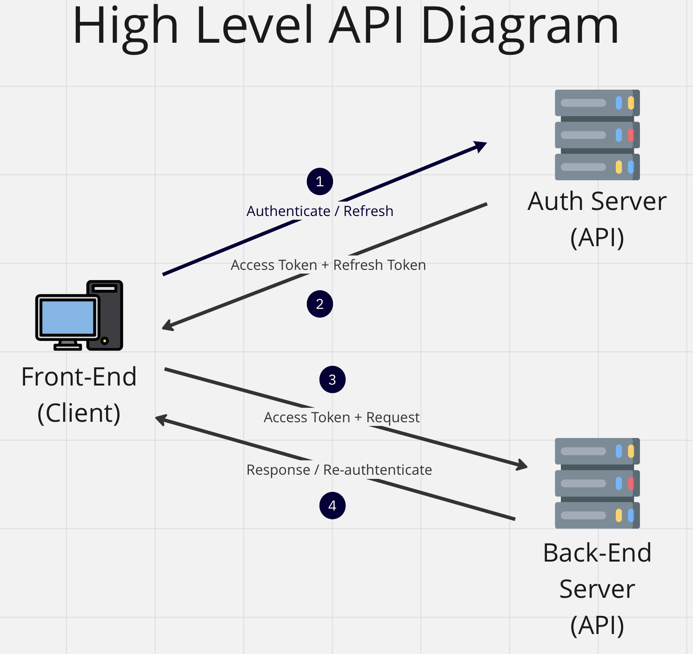
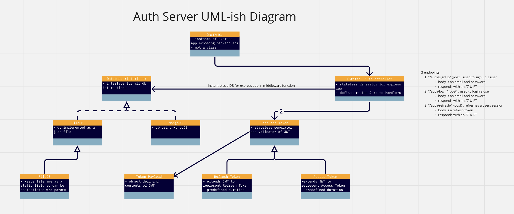
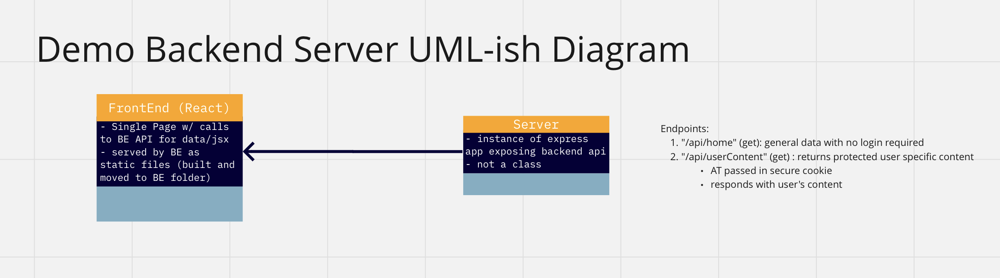

# Project Description
## Summary
This project implements the oAuth2.0 protocol, a token based authentication system, from scratch. 
It uses an authentication server to store and manage user credentials and sessions according to the oAuth2.0 protocol.
It then demos a full stack application utilizing oAuth with a React front-end served on an express.js back-end.
For demonstration purposes, access tokens duration is 10s and refresh token duration is 60s.

## Implementation Details
### Auth Server
The auth server is an API that handles storing and managing user credentials and sessions according to the oAuth2.0 protocol.
The authentication process is initiated by the user providing an email and password through a post request, which on success is responded to with both an access token and refresh token.
Both tokens are signed with a private key, ensuring authority and integrity. 
The tokens also have expiration dates to mitigate the risk of malicious attackers exploiting these tokens.
The access token is used by the client as proof of authorization to access the user's protected data from the backend.
When the access token expires, the refresh token is proof of authorization from the client in order to receive a new access token from the authorization server.
When both tokens have expired, the user is required to re-authenticate with their email and password.  
#### Languages: TypeScript
#### Modules: Express.js, cors, helmet, jsonwebtoken, mocha/chai 

  
### User Table
The user table is a database that stores user credentials. These credentials including an email, password, privilege level, and refresh token.
The password is salted and peppered before being hashed with HMAC using the RSA256 algorithm to ensure security of user login credentials.
The database is set up with an interface structure to provide room for expansion with minimal changes to existing code, but the database itself is currently implemented as a json file.
The refresh token is used to store an instance of the user's session.  
#### Languages: TypeScript, JSON  
#### Modules: fs-extra, crypto, mocha/chai  
  
### Backend  
The backend is an API through which the client receives static assets, and application related data.
The static assets in this case is the packaged React frontend, served through any call to the backend.
The application related data can be divided into 2 types of data: general data and protected data. 
General data can be accessed by any user without the need for authorization.
Protected data is usually sensitive data that is user specific and requires authorization to access.
In the case of user protected data, a custom middleware function is used to check the Authorization header in the request object.
This Authorization header contains the access token required to prove that the client is authorized to access their protected data.
#### Languages: TypeScript
#### Modules: Express.js, cors, helmet  

### Frontend
The frontend is the user's interface for interacting with the application. 
The user is prompted with a login/sign up form.
Upon submission of this form, a post request is made to the auth server. 
Upon success, an access token and refresh token is returned to the client.
These tokens are then stored in cookies, allowing them to persist in the browser.
When the client-side logic detects the presence of these cookies, the client state changes to logged in.
When the client is in the logged in state, useEffect hooks are run to obtain both general, and protected data from the backend.
The backend is also used to validate accessTokens.
When the backend detects that the client's access token is expired, a 401 status code is returned.
This signals the client to attempt to refresh its session by utilizing its access token to obtain a new access token from the auth server.
If the refresh token is still valid, the client's session will be refreshed and the request for protected data will be run again without the user having to do a thing.
If the refresh token is not valid, client state reverts to the authentication state, where the user is prompted to log in again.

#### Languages: JavaScript
#### Modules: React, Axios, React-Cookies

## Notes on implementation
- This implementation assumes the backend and auth server are hosted on separate servers:  
  - CONS:  
    - more client-side logic    
      - cookies cannot be set by the server for the client, as the path the cookie is to be sent to will not match that of its creator  
      - client must either set expiry date of cookie, or must rely on backend to check before attempting to refresh the access Token  
  - PROS:  
    - follows more closely with oAuth 2.0 protocol  
      - tokens stored in local storage/cookie  
      - passed in header Authorization param in format Bearer <Token>  
  
- A more ideal implementation is where the auth server is a subdomain of the same domain the backend api exists in:   
  - CONS:  
    - more traffic to the same server, as opposed to separating the two types of requests    
  - PROS:  
    - less client-side logic  
      - cookies are set by the backend/auth server for the client, with paths specified  
    - server-side setting of httpOnly cookies makes the tokens more secure, as they aren't viewable by XSS attacks  
  
- General Notes:
    - in the case of using httpOnly cookies or with client-side handling, it is common to use the backend/auth to verify if an accessToken is still valid  
        - this means using a hook and having to use the refresh token as a response -> long refresh process bc 2 api requests  
        - more complicated  